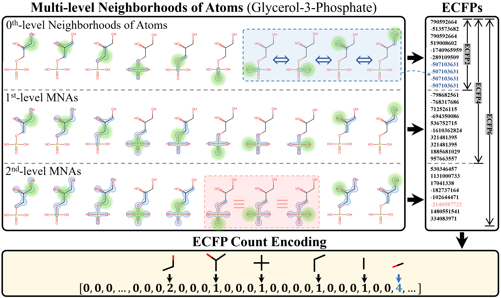
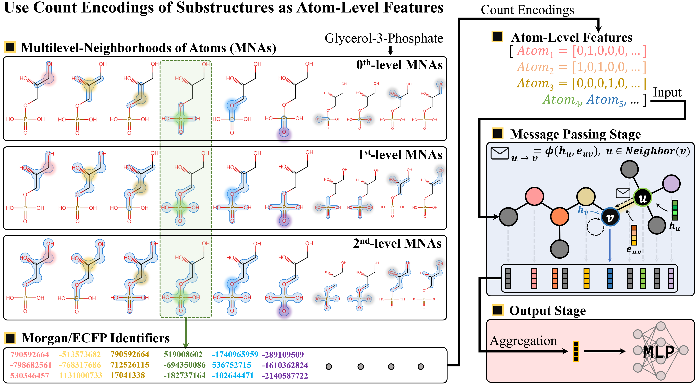

# Substructure-Aware Compound Encoding for Molecular Property Prediction

This repository supports the compound and reaction property prediction tasks described in Chapter 3 of the associated PhD thesis. Two chemically grounded compound encoding strategies are proposed and evaluated:

- **Molecule-level encoding** via ECFP count vectors
- **Atom-level encoding** via substructure count vectors integrated into MPNNs

---

## 🧠 Encoding Strategies

  

**Figure 1. Molecule-level encoding using ECFP count vectors.**  
Each molecule is decomposed into multilevel neighborhoods of atoms (MNAs), which are hashed into Morgan identifiers across multiple radii. These identifiers are aggregated into a sparse count vector representing the overall substructural composition of the molecule.

---

  

**Figure 2. Atom-level encoding using substructure count vectors.**  
Each atom is represented by a vector encoding the occurrence of surrounding substructures rooted at that atom. These vectors are used as input features to a classical MPNN, enabling the network to incorporate chemically meaningful local context during message passing.

---

## 📊 Benchmark Results

### Compound Property Prediction

| Dataset  | MoleculeNet RMSE | Chemprop RMSE | MPNN + ECFP Count Encoding (This Work) |
|----------|------------------|---------------|----------------------------------------|
| ESOL     | 0.580 ± 0.030    | 0.555 ± 0.047 | **0.536 ± 0.040**                      |
| FreeSolv | 1.150 ± 0.020    | 1.075 ± 0.054 | **1.006 ± 0.049**                      |

> **Metric:** Root Mean Squared Error (RMSE); lower is better.  
> **Note:** All results are averaged over five-fold cross-validation.

---

### Reaction Property Prediction

| Dataset             | CGR-GCNN $R^2$ | MPNN + AtomFeat (This Work) $R^2$ |
|---------------------|----------------|-----------------------------------|
| $E_a$ (E2/SN2)       | 0.93 ± 0.01     | **0.935 ± 0.020**                  |
| $\log(k)$ Reaction Rate | 0.90 ± 0.07     | **0.927 ± 0.007**                  |

> **Metric:** Coefficient of Determination ($R^2$); higher is better.

---

## 📈 Visualization of Model Performance

  

**Figure 3. Predicted vs. actual values for reaction property prediction.**  
Scatter plots show predictions versus ground truth values for $E_a$ (left) and $\log(k)$ (right) using the proposed atom-level encoding. High correlation values (Pearson $R$ and Spearman $\rho$) confirm the model’s ability to generalize across reaction types.

---

## 🔍 Summary

Together, these strategies form a consistent compound representation backbone that enhances downstream prediction and generative tasks across the thesis.

---

